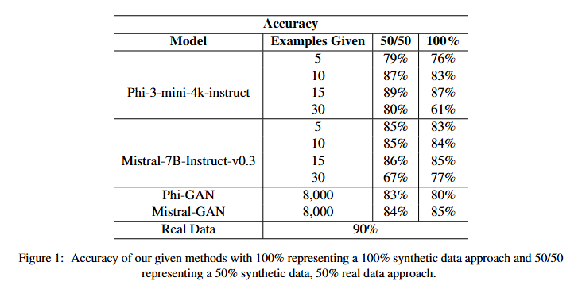

# K_shot-GAN-synthetic-data

Improving the generation of synthetic data in LLMs using k-shot prompting and a GAN.

Sentiment analysis is an important tool for businesses and governments that helps them better understand public opinions, allowing them to make decisions based on trends. A commonly used approach to sentiment analysis utilizes CNNs (Convolutional Neural Networks) which typically perform best when given large datasets. However, acquiring this data may be difficult to obtain and time-consuming. In order to address these problems, we present a new approach involving combining GANs and k-shot prompting for synthetic data generation using the Mistral-7B-v0.3 and Phi-3-Mini-4K models. 

## To start

1. Begin by running dataCleaning.ipynb.

2. Then run notebooks to train either GAN, k-shot, or k-shot + GAN. 

3. Next, generate a synthetic dataset using dataset generator.ipynb. 

4. Finally, to evaluate your models, run evals.ipynb

Requirements:
- Huggingface login credentials

## Results

We report the accuracy of our k-shot prompting
method, averaged over three runs, using varying
levels of k (5, 10, 15, and 30 examples). For our
baseline, we used the Sentiment140 dataset. Addi-
tionally, we also compared our method to a GAN
trained on the same dataset.
The accuracy of each method is shown in 1. On
both Mistral and Phi, accuracy increased as num-
ber of examples increased. The models achieved
their highest accuracy when given 15 samples with
87% and 85% accuracy for 100% synthetic data on
Mistral and Phi respectively. For a 50/50 approach,
the accuracy shows slight improvements of around
1-2%, indicating our synthetic data is comparable,
albeit slightly worse, than real data. However, as
the number of examples grew beyond 15, we ob-
served a significant decline in performance. For 30
shot, the accuracy drops over 26% in both 100%
synthetic data and the 50/50 approach for both Phi
and Mistral.

## Conclusion

In this work, we tested a new method of generating synthetic data for sentiment analysis. Our
method uses varying levels of k in k-shot prompting to generate complex, contextually accurate data. 
This research has demonstrated the efficacy of our approach in improving
the generation of synthetic data. We find that 15
shot’s performance is comparable to that of a real
dataset. Most importantly, a GAN required several
thousand data samples while our k-shot prompting approach was able to perform better with only
15 data samples, highlighting the potential of this
method to reduce the reliance on large, annotated
datasets that are costly and time-consuming to obtain. Ultimately, the results from our experiments
show our method’s potential to overcome current
limitations in synthetic data generation, paving the
way for more sophisticated and accurate models in
sentiment analysis and beyond.